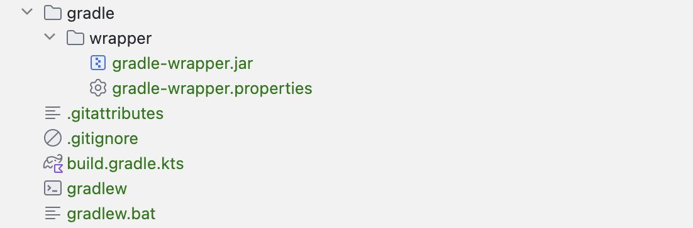

## Gradle-wrapper 란?
spring boot 프로젝트를 gradle 로 진행하거나, 다른 프로젝트들을 gradle 로 진행하면 항상 아래와 같은 gradle wrapper 파일이 생성된다.

gradle-wrapper 란 gradle 에서 제공하는 빌드 시스템으로, 별도의 gradle 설치 없이도 gradle 로 빌드 할 수 있게 만들어주는 기능이다.

gradle-wrapper 를 사용하면 `gradlew` `gradlew.bat` `gradle-wrapper.jar` `gradle-wrapper.properties`
가 생성된다.

1. gradlew : Unix 기반 시스템들에서 gradle 을 실행하는 스크립트 파일
2. gradlew.bat : windows 시스템에서 gradle 을 실행하는 스크립트 파일
3. gradle-wrapper.jar : gradle 래퍼를 실행하기 위한 jar 파일
4. gradle-wrapper.properties : Gradle 래퍼 설정 파일로, 사용하는 Gradle 버전을 지정함

## 래퍼 파일이란?

래퍼 파일은 프로젝트 내에서 특정 소프트웨어나 프로그램을 실행시킬 수 있게 해주는 파일이다.
> 소프트웨어나 툴이 설치되지 않아도 일관된 환경에서 빌드를 수행할 수 있도록 돕는 역할을 한다.
{: .prompt-info}

래퍼 파일을 사용함으로써 개발자들간 빌드 환경 차이를 줄이고, **일관된 빌드**를 할 수 있게 된다.
