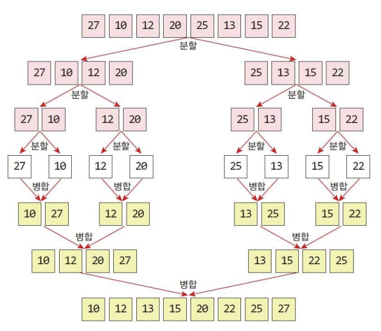

## 합병정렬이란?
합병정렬은 리스트를 잘개 쪼개고(분할) 쪼갠 리스트를 병합(합병)하여 정렬되는 알고리즘이다.

합병 정렬은 분할-정복 기법을 사용하였다.
> [분할정복이란?](/posts/quick-sort)
{: .prompt-info}

합병 정렬은 안정성을 만족하는 알고리즘이다.

합병정렬의 시간복잡도는 `O(nlog₂n)` 이라는 매우 짧은 시간을 가진다.

합병정렬의 최악의 시간복잡도 또한 `O(nlog₂n)` 을 가진다

> 하지만, 합병정렬은 정렬할 리스트의 크기만큼의 레코드를 확보해야 한다.
{: .prompt-warning}

## 합병 정렬의 방법
합병정렬의 방법은 다음과 같다.



1. 배열을 반으로 나눈다.
2. 나눈 배열의 왼쪽부터 먼저 나눈다.
3. 나눈 배열이 하나의 값을 가지게 되면, 이웃된 두개의 배열을 병합한다.
4. 나머지를 병합한다.
5. 정렬 완료

## 파이썬 코드
파이썬 코드를 통한 합병정렬의 흐름은 다음과 같다.

```python
def merge(arr, left, mid, right):
  global sorted
  i = left
  j = mid + 1
  k = left
  
  while i <= mid and j <= right:
    if arr[i] <= arr[j]:
      sorted[k] = arr[i]
      i, k = i+1, k+1
    else:
      sorted[k] = arr[j]
      j, k = j+1, k+1
```
